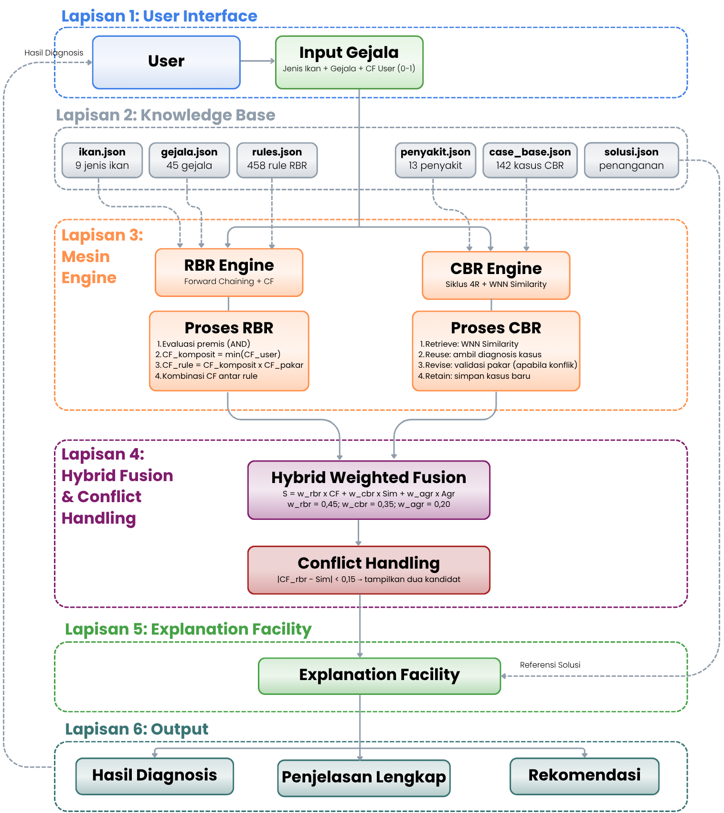

# Perancangan Sistem Pakar Diagnosis Penyakit Ikan Air Tawar Menggunakan Hybrid Case-Based Reasoning dan Rule-Based Reasoning

## AquaCase Expert

AquaCase Expert adalah prototipe sistem pakar berbasis web untuk membantu diagnosis penyakit ikan air tawar. Sistem ini menggunakan pendekatan hybrid dengan menggabungkan Rule-Based Reasoning (RBR) dan Case-Based Reasoning (CBR), sehingga hasil diagnosis dapat dibandingkan dari sisi aturan pakar dan kasus terdahulu.

## Nama Kelompok

**Sistem Pakar Butuh Buk Kar**

## Anggota Kelompok

1. Andra Kusnaedi Ilyaz - 24/537757/PA/22793
2. Azhar Maulana - 24/533487/PA/22582
3. Bobby Rahman Hartanto - 24/539383/PA/22903
4. Kukuh Agus Hermawan - 24/533395/PA/22573
5. Rayhan Haldi Hermawan - 24/545406/PA/23176

## Deskripsi Sistem

Sistem digunakan dengan cara memilih jenis ikan, memilih gejala yang diamati, lalu mengisi tingkat keyakinan atau Certainty Factor (CF) pada setiap gejala. Setelah input diberikan, sistem memproses diagnosis menggunakan dua pendekatan, yaitu RBR dan CBR. Hasil akhir yang ditampilkan berupa penyakit utama, skor RBR, skor CBR, agreement score, final score, status keyakinan, rule aktif, kasus paling mirip, serta solusi pengobatan dan pengendalian.

## Demo Sistem

Demo sistem dapat diakses melalui:

https://aquacase-expert-eosin.vercel.app

## Folder Pengumpulan

Folder pengumpulan berisi video presentasi dan demo, proposal, laporan akhir, serta berkas pendukung proyek.

https://drive.google.com/drive/folders/1AsmoDpxuH_6szKrISmLHKA_n5pYosjvB?usp=sharing

## Sumber Data

Knowledge base diadaptasi dari tesis Hisma Abduh tentang diagnosis penyakit ikan air tawar menggunakan Rule-Based Reasoning dan Case-Based Reasoning. Data penyakit ikan berasal dari Balai Pengembangan Teknologi Kelautan dan Perikanan Argomulyo, Yogyakarta.

## Cakupan Knowledge Base

Data yang digunakan dalam sistem mencakup:

* 9 jenis ikan air tawar
* 45 gejala penyakit
* 13 jenis penyakit ikan
* 13 solusi pengobatan dan pengendalian
* 78 relasi gejala dan penyakit
* 458 rule RBR
* 142 data kasus CBR
* 30 data uji

## Arsitektur Sistem
<div>
  
</div>

AquaCase Expert terdiri dari beberapa komponen utama berikut.

### 1. Frontend Web

Frontend digunakan sebagai antarmuka pengguna. Pada bagian ini pengguna dapat memilih jenis ikan, memilih gejala, mengisi nilai CF, melihat hasil diagnosis, melihat basis aturan, melihat basis kasus, dan melihat riwayat diagnosis.

### 2. Backend API

Backend berfungsi sebagai penghubung antara frontend dan engine diagnosis. Backend menerima input dari pengguna, memanggil proses RBR dan CBR, menjalankan hybrid fusion, lalu mengirim hasil diagnosis kembali ke frontend.

### 3. Knowledge Base

Knowledge base menyimpan seluruh data yang dibutuhkan sistem dalam format JSON. Data ini meliputi data ikan, gejala, penyakit, solusi, rule RBR, detail rule-gejala, case base CBR, detail kasus-gejala, dan data uji.

### 4. RBR Engine

RBR engine digunakan untuk mencocokkan gejala pengguna dengan rule pakar. Sistem menjalankan forward chaining, menghitung CF komposit dari gejala, menghitung CF rule, lalu menggabungkan beberapa rule yang mengarah ke penyakit yang sama.

### 5. CBR Engine

CBR engine digunakan untuk mencari kasus lama yang paling mirip dengan input pengguna. Sistem membandingkan jenis ikan dan gejala yang dipilih dengan basis kasus lama menggunakan similarity, lalu mengambil kasus terdekat sebagai pembanding diagnosis.

### 6. Hybrid Fusion

Hybrid fusion menggabungkan skor dari RBR, skor dari CBR, dan agreement score. Jika RBR dan CBR mengarah ke penyakit yang sama, nilai agreement menjadi tinggi. Jika hasil keduanya berbeda, sistem tetap menampilkan kandidat diagnosis agar dapat ditinjau kembali.

### 7. Explanation Facility

Explanation facility digunakan untuk menjelaskan alasan diagnosis. Sistem menampilkan rule yang aktif, kasus CBR yang paling mirip, gejala yang cocok, skor yang dihitung, status keyakinan, dan solusi penanganan penyakit.

## Metode yang Digunakan

### Rule-Based Reasoning

Rule-Based Reasoning digunakan untuk mendiagnosis penyakit berdasarkan aturan IF-THEN dari pakar. Setiap rule menghubungkan kombinasi gejala dengan penyakit tertentu. Nilai keyakinan dihitung menggunakan Certainty Factor.

```
CF_komposit  = min(CF_gejala_1, CF_gejala_2, ..., CF_gejala_n)
CF_rule      = CF_komposit × CF_pakar
CF_combine   = CF1 + CF2 × (1 - CF1)   ← jika beberapa rule → penyakit sama
```

### Case-Based Reasoning

Case-Based Reasoning digunakan untuk membandingkan kasus baru dengan kasus lama. Jika input pengguna mirip dengan kasus terdahulu, sistem menggunakan kasus tersebut sebagai dasar pendukung diagnosis dan dihitung menggunakan Weighted Nearest Neighbor.

```
Similarity(S, T) = ( Σ f(Si, Ti) × wi / Σ wi ) × P(S)
```

### Hybrid Fusion

Hybrid Fusion digunakan untuk menggabungkan hasil RBR dan CBR menjadi satu skor akhir. Skor akhir mempertimbangkan CF RBR, similarity CBR, dan agreement score.

```
S_final = (0.45 × CF_RBR) + (0.35 × Sim_CBR) + (0.20 × Agreement)
 
Agreement = 1.0  → RBR dan CBR sepakat
Agreement = 0.5  → berbeda, selisih < 0.15 (konflik lemah)
Agreement = 0.0  → konflik signifikan
```

### Conflict Handling

Conflict handling digunakan ketika hasil RBR dan CBR berbeda. Sistem membandingkan skor kedua metode. Jika perbedaannya kecil, sistem menampilkan lebih dari satu kandidat diagnosis. Jika perbedaannya besar, sistem mengikuti hasil dengan skor yang lebih kuat.

```
Δ = |CF_RBR - Sim_CBR|
 
Δ < 0.15  → tampilkan dua kandidat diagnosis + saran validasi pakar
Δ ≥ 0.15  → ikuti engine dengan skor lebih tinggi
```

### Status Threshold
| Status | Kondisi |
|--------|---------|
| **Kuat** | S_final ≥ 0.75 |
| **Sedang** | 0.50 ≤ S_final < 0.75 |
| **Lemah** | S_final < 0.50 |

## Alur Diagnosis

Alur diagnosis pada sistem adalah sebagai berikut:

1. Pengguna membuka halaman diagnosis.
2. Pengguna memilih jenis ikan air tawar.
3. Pengguna memilih gejala yang terlihat pada ikan.
4. Pengguna mengisi nilai CF pada setiap gejala.
5. Sistem memproses input menggunakan RBR.
6. Sistem memproses input menggunakan CBR.
7. Sistem menggabungkan hasil RBR dan CBR menggunakan hybrid fusion.
8. Sistem menampilkan diagnosis utama, skor, kasus serupa, rule aktif, dan solusi penanganan.

## Output Sistem

Output yang ditampilkan sistem meliputi:

* nama penyakit hasil diagnosis;
* final score;
* status keyakinan diagnosis;
* skor RBR;
* skor CBR;
* agreement score;
* rule aktif yang mendukung diagnosis;
* kasus lama yang paling mirip;
* gejala yang cocok;
* rekomendasi pengobatan;
* rekomendasi pengendalian.

## Fitur Sistem

Fitur yang tersedia pada AquaCase Expert adalah:

* diagnosis penyakit ikan air tawar berbasis web;
* input jenis ikan, gejala, dan nilai CF pengguna;
* perhitungan diagnosis menggunakan RBR;
* pencarian kasus serupa menggunakan CBR;
* penggabungan hasil menggunakan hybrid fusion;
* explanation facility untuk menjelaskan hasil diagnosis;
* halaman basis aturan RBR;
* halaman basis kasus CBR;
* riwayat diagnosis pada frontend;
* tampilan hasil diagnosis beserta solusi penanganan.

## Skenario Demo

Contoh skenario pengujian demo:

| Skenario | Input                                     | Output                           | Keterangan                                                         |
| -------- | ----------------------------------------- | -------------------------------- | ------------------------------------------------------------------ |
| S1       | Patin; G02=0.7, G04=0.5, G05=0.8, G07=0.5 | P01 MAS; final 93.73%            | RBR dan CBR mendukung penyakit yang sama, sehingga diagnosis kuat. |
| S2       | Lele; G13=0.2, G16=0.1, G43=0.6, G23=0.7  | P06 Trichodiniasis; final 88.67% | Gejala cocok dengan rule dan kasus lama.                           |
| S3       | Koi; G29=0.7, G31=0.8, G06=0.4            | P09 KHV; final 80.88%            | RBR kuat dan CBR masih memberi dukungan.                           |
| S4       | Udang; G08=0.1, G17=0.2, G41=0.8          | P11 IHHN; final 62.92%           | CBR membantu saat skor RBR tidak terlalu tinggi.                   |

## Kelebihan Sistem

* Knowledge base sudah tersusun dalam format JSON sehingga mudah digunakan.
* RBR memberikan dasar diagnosis berdasarkan aturan pakar.
* CBR memberikan pembanding berdasarkan kasus terdahulu.
* Hybrid fusion membuat hasil diagnosis lebih kuat karena menggabungkan dua pendekatan.
* Explanation facility membuat hasil diagnosis lebih mudah dipahami dan ditelusuri.

## Keterbatasan Sistem

* Cakupan penyakit masih terbatas pada 13 penyakit sesuai sumber data.
* Nilai CF pakar masih perlu validasi lebih lanjut oleh pakar perikanan.
* Solusi yang diberikan bersifat rekomendasi awal dan tetap perlu konfirmasi pakar apabila kasus di lapangan lebih kompleks.

## Kesimpulan

AquaCase Expert berhasil dibuat sebagai sistem pakar diagnosis penyakit ikan air tawar berbasis web. Sistem menggunakan knowledge base JSON, Rule-Based Reasoning, Case-Based Reasoning, hybrid fusion, dan explanation facility. Dengan alur tersebut, sistem tidak hanya memberikan hasil diagnosis, tetapi juga menampilkan alasan, skor pendukung, kasus serupa, rule aktif, dan solusi penanganan.
